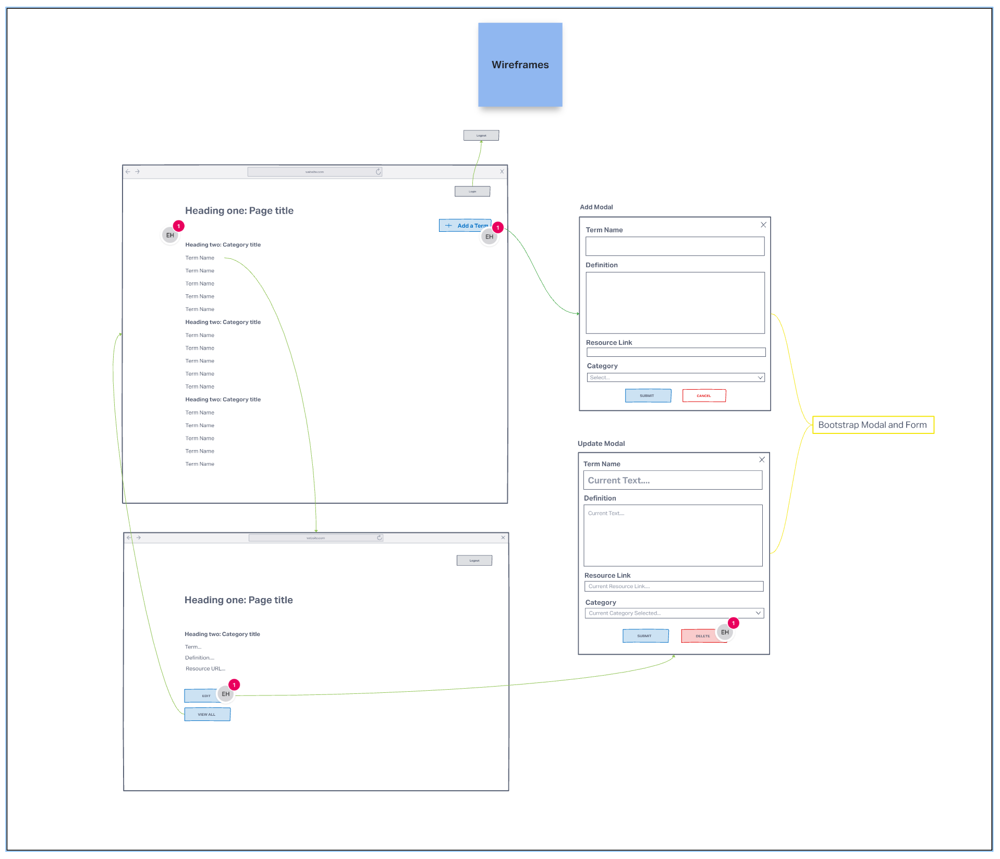
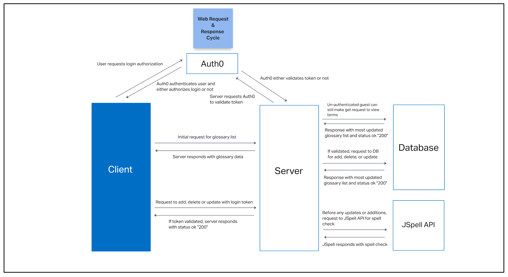
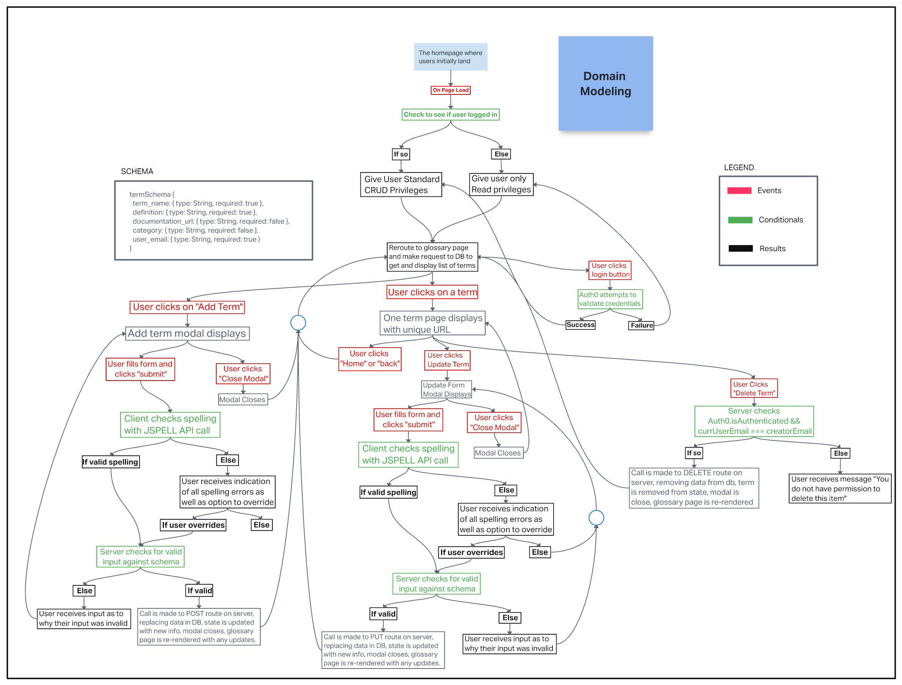

# Software Glossary App

## Deployed Site

[Deployed Netlify site](https://comforting-caramel-46654a.netlify.app/)

## Members

- Elizabeth Hammes
- Guy Farley
- Benjamin Small
- Brady Davenport

## Problem Domain

Our team was tasked by the VP of Education at Code Fellows to create a real-world application for our final project. Students at Code Fellows needed a better way to keep track of and review all the terms they learned throughout their Code Fellows courses. The client's primary requirements were as follows:

- To maintain a database encompassing all terms relevant to the coursework and to present those terms in an aesthetically pleasing way to the user
- To allow students to log into an account in order to view, add, update, and delete terms
- To allow the user to review spelling errors before submitting a new or updated term, to ensure all terms remained correctly spelled and grammatically correct

**Stretch Goals**: admin approvals, flash-card mode, multi-lingual support

## Features / Routes

- Glossary term data is stored and accessed within a MongoDB database, making use of an Express server on the backend to handle all CRUD operations via Mongoose.
- Auth0 is used to manage authorization/authentication, in which a token is requested and received based on successful login.
- Unauthorized users are able to view all terms currently in the database. These terms are retrieved by an initial GET request.
- Authorized users gain access to additional features of the site, including the ability to add, update, or delete a term via REST requests to the backend server.
- Upon submission of a term addition or update, the data is sent by the server to a 3rd party API (JSpell). JSpell responds with information regarding any misspellings, which triggers an alert modal that requests the user to review and either (1) override and submit as-is or (2) correct the spelling and re-submit.

## Documentation

### Wireframes

### Web Request Response Cycle

### Domain Model

## Resources

- [reactjs.org](https://reactjs.org)
- [auth0.com/docs](https://auth0.com/docs)
- [ria.directory](https://ria.directory)
- [react-bootstrap.github.io](https://react-bootstrap.github.io)
- [www.npmjs.com/package/axios](https://www.npmjs.com/package/axios)
- [www.jspell.com/checker](https://www.jspell.com/checker)
